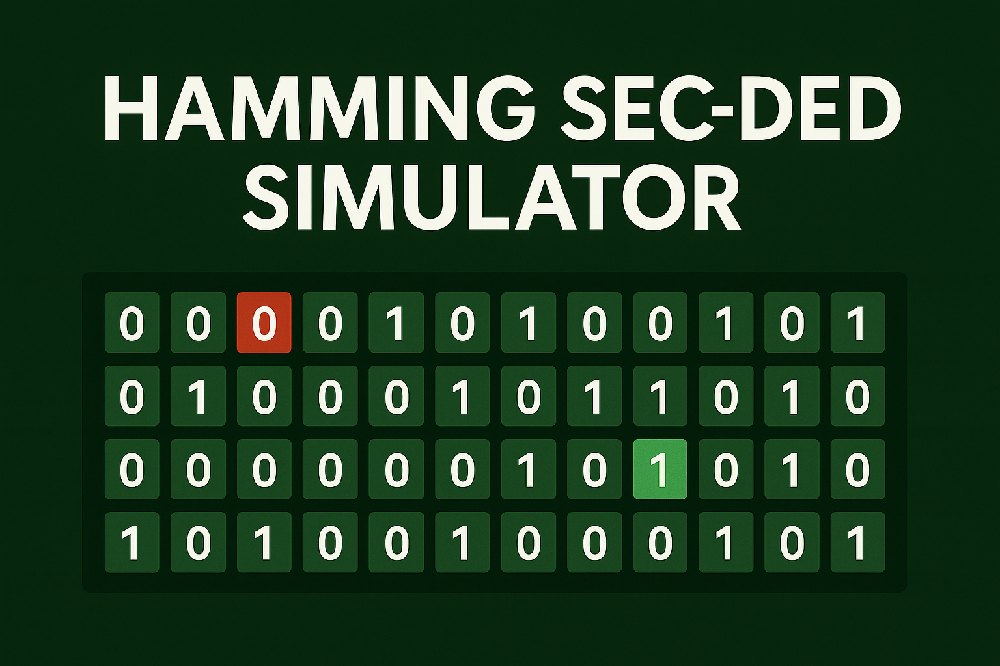
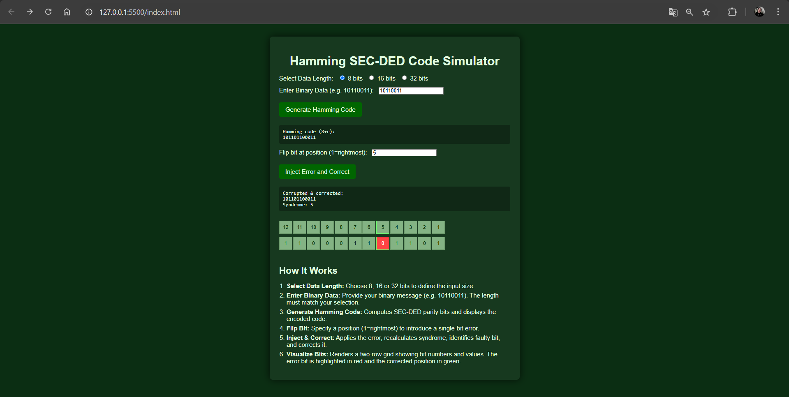
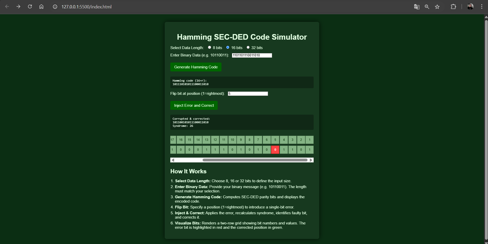
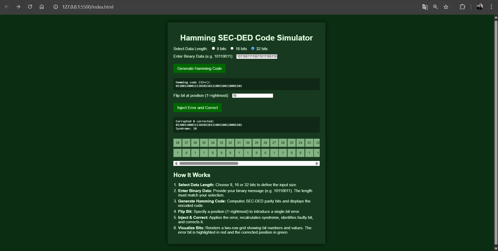

# Hamming SEC-DED Code Simulator

A lightweight web-based simulator demonstrating the Single Error Correction, Double Error Detection (SEC-DED) Hamming code process. Users can encode binary data, inject a single-bit error, correct it, and visualize each step in an interactive grid.

---

## 🔍 Features

* **Dynamic Data Lengths:** Supports 8, 16, or 32-bit input messages.
* **SEC-DED Encoding:** Calculates parity bits and overall parity for double-error detection.
* **Error Injection & Correction:** Flip a specified bit, compute syndrome, identify and fix the error.
* **Visual Grid:** Interactive two-row grid showing bit positions and values; highlights error bit (red) and corrected bit (green).
* **Responsive UI:** Modern, accessible design with horizontal scrolling for long bit sequences.

---

## 🚀 Installation

1. **Clone the repository**

   ```bash
   git clone https://github.com/sevginuroksuz/hamming-code-simulator.git
   cd hamming-code-simulator
   ```
2. **Open in Browser**

   * Simply open `index.html` in your preferred browser.
   * *(Optional)* Serve via a local web server for full functionality:

     ```bash
     npx http-server .
     ```

---

## 🎬 Video Demo

Watch the simulator in action on YouTube:

[](https://www.youtube.com/watch?v=r8VfNTvKFow)

*Click the thumbnail above or [watch on YouTube](https://www.youtube.com/watch?v=r8VfNTvKFow).*

---

## 📸 Screenshots

Below are some screenshots demonstrating the simulator workflow:

| Step                  | Screenshot                     |
| --------------------- | ------------------------------ |
| Generate Hamming Code - 8 bit |   |
| Generate Hamming Code - 16 bit |     |
| Generate Hamming Code - 32 bit |  |

---

## 🖥️ Usage

1. **Select Data Length**
   Choose **8**, **16**, or **32** bits from the radio buttons.

2. **Enter Binary Data**
   Input your binary string (must match selected length) and click **Generate Hamming Code**.

3. **Generate Code**
   The encoded SEC-DED code appears in the output box.

4. **Inject & Correct Error**

   * Enter a bit position (1 = rightmost) in the **Flip bit at position** field.
   * Click **Inject Error and Correct**.
   * The corrupted & corrected code and syndrome value display below.

5. **Visualize Bits**

   * Click **Show Bit Visualization** to render a two-row grid:

     * **Top Row:** Bit positions (1…N).
     * **Bottom Row:** Bit values after correction.
     * **Red Cell:** Injected error position.
     * **Green Outline:** Corrected bit (syndrome result).

---

## 📂 Project Structure

```
├── index.html       # Main UI
├── styles.css       # Styles and layout
├── script.js        # Encoding, error handling, visualization logic
├── README.md        # This file
└── assets/          # Screenshots and thumbnails
```

---

## 🤝 Contributing

Feel free to open issues or submit pull requests. Any enhancements—such as additional bit-length support or styling improvements—are welcome!

---

## 📜 License

This project is released under the MIT License. See [LICENSE](LICENSE) for details.

---

*Sevgi Nur Öksüz, 2025*
